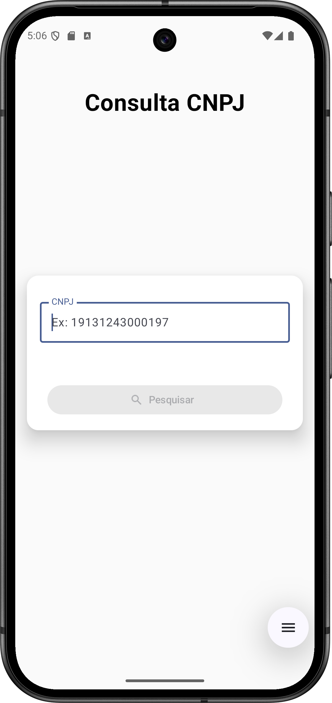
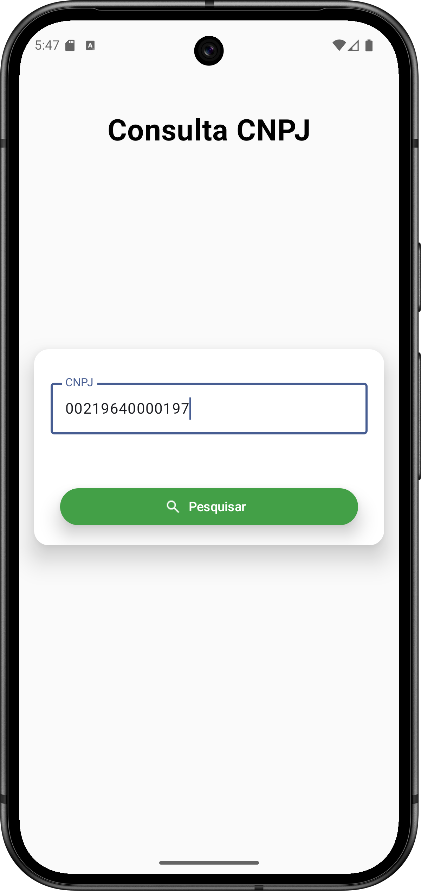

# 🚀 Cariri CNPJ Checker

## 🔹 Sobre o projeto

**Cariri CNPJ Checker** é um app simples e rápido para consultar informações completas de CNPJs usando a [Brasil API](https://brasilapi.com.br/).  

Ele retorna:  
- ✅ Situação cadastral  
- ✅ Dados da empresa (nome, razão social, etc.)  
- ✅ Endereço completo  
- ✅ Atividade principal e secundárias  
- ✅ Informações sobre sócios  

Tudo **100% gratuito**, ideal para praticar Android e integração com APIs.

---

## 🛠 Tecnologias e arquitetura

O app foi desenvolvido com foco em **boas práticas** e escalabilidade:  

- **MVVM**: separação clara entre UI e lógica de negócios  
- **Hilt**: injeção de dependências  
- **Retrofit**: consumo da API Brasil  
- **Coroutines**: chamadas assíncronas e gerenciamento de estado  
- **Repositories e ViewModels**: arquitetura limpa e organizada  

---

## 📸 Screenshots

  
  
  

